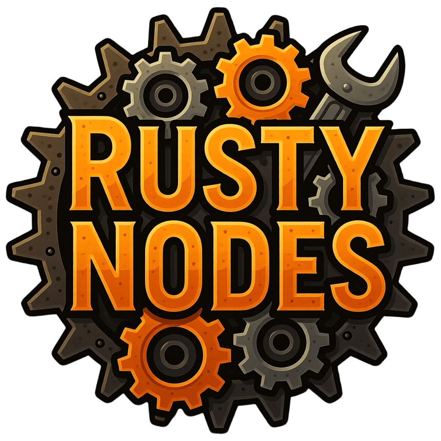

# Rusty Nodes 

A collection of useful custom nodes that help with a wide range of tasks.

## Current Nodes

- `Base64ToImage`: Convert a Base64‑encoded string into an image.
- `ImageToBase64`: Convert an image into a Base64‑encoded string.

## Join the telegram group

If you'd like to discuss this project, ComfyUI, or generative AI in general, join our Telegram community:
https://t.me/thelatentspace

## Contributing
Contributions are welcome! Please feel free to submit issues, node ideas, or pull requests!

## License

[MIT](LICENSE) © [Rafael Milewski](https://github.com/milewski)
